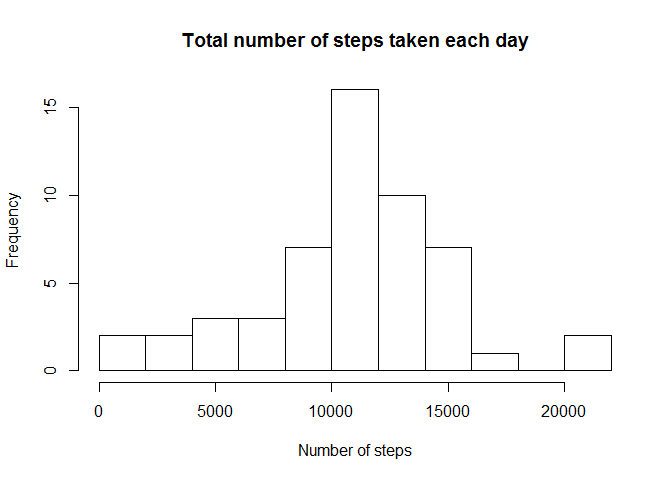
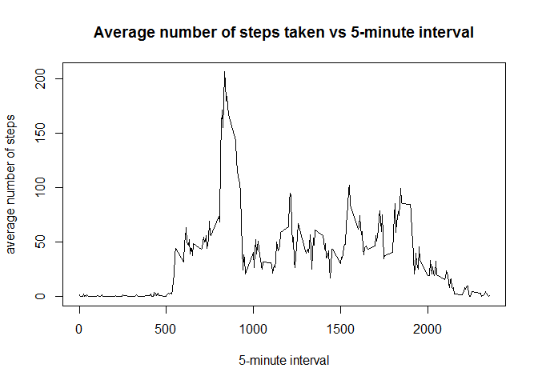
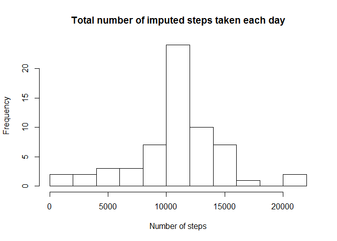
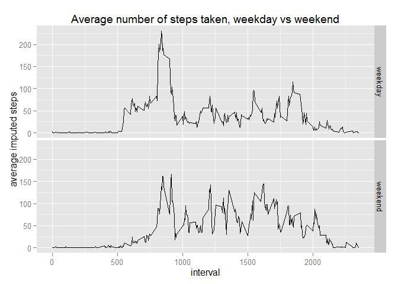

# Reproducible Research: Peer Assessment 1

## Loading and preprocessing the data

```r
###Load the data
setwd("C:/Users/Luc/Documents/coursera/Reproducible Research/RepData_PeerAssessment1")
unzip("activity.zip")
activity <- read.csv("./activity.csv")
```

## What is mean total number of steps taken per day?

```r
library(dplyr)
```

```
## 
## Attaching package: 'dplyr'
## 
## The following objects are masked from 'package:stats':
## 
##     filter, lag
## 
## The following objects are masked from 'package:base':
## 
##     intersect, setdiff, setequal, union
```

```r
###For this part of the assignment, you can ignore the missing values in the dataset.
###Calculate the total number of steps taken per day
sum_steps<-activity %>% filter(!is.na(steps)) %>% group_by(date) %>% summarise(sum_steps = sum(steps))
###Make a histogram of the total number of steps taken each day
hist(sum_steps$sum_steps, main="Total number of steps taken each day",xlab="Number of steps",breaks=10)
```

 

```r
###Calculate and report the mean and median of the total number of steps taken per day
mean(sum_steps$sum_steps)
```

```
## [1] 10766.19
```

```r
median(sum_steps$sum_steps)
```

```
## [1] 10765
```

## What is the average daily activity pattern?

```r
###Make a time series plot of the 5-minute interval (x-axis) and the average number of steps taken, averaged across all days (y-axis)
intervals<-activity %>% filter(!is.na(steps)) %>%group_by(interval) %>% summarise(mean_steps = mean(steps))
###Make a histogram of the averae number of steps taken each day
plot(intervals$interval,intervals$mean_steps,type = "l", main='Average number of steps taken vs 5-minute interval', xlab='5-minute interval', ylab='average number of steps')
```

 

```r
###Which 5-minute interval, on average across all the days in the dataset, contains the maximum number of steps?
intervals[intervals$mean_steps==max(intervals$mean_steps),]
```

```
## Source: local data frame [1 x 2]
## 
##   interval mean_steps
##      (int)      (dbl)
## 1      835   206.1698
```

## Imputing missing values

```r
###Calculate and report the total number of missing values in the dataset (i.e. the total number of rows with NAs)
summary(activity$steps)
```

```
##    Min. 1st Qu.  Median    Mean 3rd Qu.    Max.    NA's 
##    0.00    0.00    0.00   37.38   12.00  806.00    2304
```

```r
###Devise a strategy for filling in all of the missing values in the dataset.
###Use of the mean for that 5-minute interval to imputing missing values.
mean_steps<-activity %>% filter(!is.na(steps)) %>%group_by(interval) %>% summarise(mean_int_steps = round(mean(steps)))
###Create a new dataset that is equal to the original dataset but with the missing data filled in.
activity2<-left_join(activity, mean_steps, by = "interval")
activity2$steps_imputed<-ifelse(is.na(activity2$steps), activity2$mean_int_steps, activity2$steps)
###Make a histogram of the total number of steps taken each day
sum_steps_imputed<-activity2 %>%group_by(date) %>% summarise(sum_steps_imputed = sum(steps_imputed))
hist(sum_steps_imputed$sum_steps_imputed, main='Total number of imputed steps taken each day',xlab='Number of steps',breaks=10)
```

 

```r
###Calculate and report the mean and median total number of steps taken per day.
mean(sum_steps_imputed$sum_steps_imputed)
```

```
## [1] 10765.64
```

```r
median(sum_steps_imputed$sum_steps_imputed)
```

```
## [1] 10762
```

####Do these values differ from the estimates from the first part of the assignment? What is the impact of imputing missing data on the estimates of the total daily number of steps?
No, these values do not differ from the estimates from the first part of the assignment.  
By imputing each of the interval with missing number of steps with the average number of steps of the interval, it has no impact on the estimates of the total daily number of steps.

## Are there differences in activity patterns between weekdays and weekends?

```r
###Create a new factor variable in the dataset with two levels - "weekday" and "weekend" indicating whether a given date is a weekday or weekend day.
activity$date <- as.POSIXct(activity$date)
Sys.setlocale("LC_TIME", "English")
```

```
## [1] "English_United States.1252"
```

```r
activity2$day<-ifelse(weekdays(activity$date)=='Saturday' | weekdays(activity$date)=='Sunday', 'weekend', 'weekday')
intervals_day<-activity2 %>%group_by(day,interval) %>% summarise(mean_steps_imputed = mean(steps_imputed))
###Make a panel plot containing a time series plot of the 5-minute interval (x-axis) and the average number of steps taken, averaged across all weekday days or weekend days (y-axis).
library(ggplot2)
ggplot(intervals_day, aes(x = interval, y = mean_steps_imputed)) + geom_line() +
  xlab("interval") + ylab("average imputed steps") + facet_grid(day ~ .) +
  ggtitle("Average number of steps taken, weekday vs weekend")
```

 
